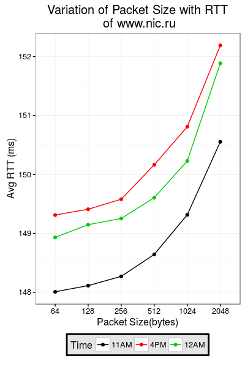
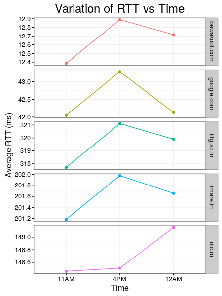

# Networks Lab: Assignment 1

##### Repository for Networks Lab Assignment 1

---

### Scripts:  ###
* `pingfile.py` : Python script for pinging hosts. Generates csv of ping data.
* `que1_part1.R` : R Script for calculating average RTT for each host. Plots `Time` vs `Avearge RTT` for each host.
* `que1_part2.R` : R script for calculating average RTT for nic.ru for each packet size. Plots `Packet Size` vs `Avergae RTT` at 3 different hours of a day.
* `lab.Rmd` : Assignment Submission 
* `Assignment1.pdf` : Assignment1 instructions

## Data :memo: :memo: ##
* `Data/allhost_20times_64bytes1.csv` : All hosts mentioned in `pingfile.py` pinged 20 times at 64 bytes around 11AM  
* `Data/allhost_20times_64bytes2.csv` : All hosts mentioned in `pingfile.py` pinged 20 times at 64 bytes around 4 PM  
* `Data/allhost_20times_64bytes3.csv` : All hosts mentioned in `pingfile.py` pinged 20 times at 64 bytes around 12 AM  
* `Data/nicru20times_allsizes1.csv` : [nic.ru](nic.ru) pinged 20 times at  64, 128 256, 512, 1024 and 2018 bytes around 11 AM  
* `Data/nicru20times_allsizes2.csv` : [nic.ru](nic.ru) pinged 20 times at  64, 128 256, 512, 1024 and 2018 bytes around 4 PM  
* `Data/nicru20times_allsizes3.csv` : [nic.ru](nic.ru) pinged 20 times at  64, 128 256, 512, 1024 and 2018 bytes around 12 AM  

### Libraries used: ###
* `requests`(Python)  
* `ggplot2`(R)  
* `dplyr`(R)
* `magrittr`(R)

### Plots :bar_plot: :chart_with_upwards_trend: ###

### References :link: ###
**Style**: [Hadley Wickham's R Style Guide](http://r-pkgs.had.co.nz/style.html)  
**Linter**: [`lintr` package](https://github.com/jimhester/lintr)

