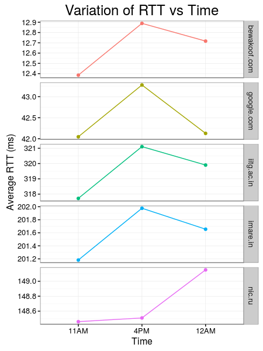

### Question 1

|Host Name    |spfld.com.Location |Geo Location of Host       |Averge RTT |Packet Loss (%)       |
|:------------|:------------------|:--------------------------|:----------|:---------------------|
|bewakoof.com |Kansas, USA        |San Jose, California , USA |12.66      |No Loss (0%)          |
|google.com   |Kansas, USA        |MV, California , USA       |42.48      |No Loss (0%)          |
|iitg.ac.in   |Kansas, USA        |Guwahati, India            |319.57     |Positive Loss (0.42%) |
|imare.in     |Kansas, USA        |Amravati, India            |201.6      |No Loss (0%)          |
|nic.ru       |Kansas, USA        |Moscow, Russia             |148.71     |Positive Loss (0.08%) |



As clearly evident from the table, Avergae RTT of each of the 5 hosts **very strongly correlates to Geograhical distance** between sdfld.com location (Kansas, USA) and the geographical location of hosts. [Google.com](Google.com) and [Bewakoof.com](bewakoof.com) have *highest pings* as California is nearest to Kansas. [iitg.ac.in](iitg.ac.in) on the other hand is farthest and is reporting *maximum average RTT*.

Only two hosts, [iitg.ac.in](iitg.ac.in) and [nic.ru](nic.ru) reported non-zero packet losses. iitg.ac.in reported packet loss around 11 AM IST and nic.ru reported packet loss around 4 PM IST. 

Possible reasons of packet loss:   
1. Link congestion  
2. Host firewall blocking ICMP  
3. Duplex mistmatch  

When [nic.ru](nic.ru) was pinged with packet sizes 64, 128, 512, 1024 and 2048 (in bytes), we observed that:   
* Avergae RTT increases with increase in packet size (though the increase is very small)   
* Avergae RTT is different on different time of the day irrespective of packet size (again the change is difference is small)

---

### Question 2
#### Q2(A) Capture the output of ifconfig with necessary options, and identify and explain as
####much of what is printed as you can.
```
$ ifconfig

eth0      Link encap:Ethernet  HWaddr 9c:b6:54:c3:01:4a  
          inet addr:10.4.12.9  Bcast:10.4.63.255  Mask:255.255.192.0
          inet6 addr: fe80::9eb6:54ff:fec3:14a/64 Scope:Link
          UP BROADCAST RUNNING MULTICAST  MTU:1500  Metric:1
          RX packets:281300 errors:0 dropped:215 overruns:0 frame:0
          TX packets:20617 errors:0 dropped:0 overruns:0 carrier:0
          collisions:0 txqueuelen:1000 
          RX bytes:32190846 (32.1 MB)  TX bytes:5785402 (5.7 MB)

lo        Link encap:Local Loopback  
          inet addr:127.0.0.1  Mask:255.0.0.0
          inet6 addr: ::1/128 Scope:Host
          UP LOOPBACK RUNNING  MTU:65536  Metric:1
          RX packets:1572 errors:0 dropped:0 overruns:0 frame:0
          TX packets:1572 errors:0 dropped:0 overruns:0 carrier:0
          collisions:0 txqueuelen:0 
          RX bytes:122496 (122.4 KB)  TX bytes:122496 (122.4 KB)

```
**eth0** and **lo** are the names of active network interfaces on the system.   
1. eth0 is the first ethernet interface.  
2. lo is loopback interface that the system uses to communicate with itself.

##### eth0 and lo output explained  
**HWaddr** : Physical MAC  
**inet addr** : IPv4 Address of **eth0** interface  
**Bcast** : Broadcast address of the interface  
**Mask** : To determine what subnet this **inet addr** belongs to  
**inet6 addr** : IPv6 Address  
**MTU** : maximum size of each packet in the transmission  
**UP** : Flag indicate interface modules are loaded
**RUNNING** : Interface is ready to accept data  
**Metric** : Priority of this interface over other interface  
**RX/TX Packets** : Total number of packets received and transmitted respectively

#### Q2(B) Explain the output of route command and its options.  
```
$ route

Kernel IP routing table
Destination     Gateway         Genmask         Flags Metric Ref    Use Iface
default         10.4.0.254      0.0.0.0         UG    0      0        0 eth0
10.4.0.0        *               255.255.192.0   U     1      0        0 eth0
```
* Used to view/manipulate IP routing table
* Explanation of fields:
    * Destination :  Destination Host
    * Gateway :  Gateway Address
    * Genmask : Netmask for the destination net  
    * Flags : Flags indicating state of route  
    * Metric : The distance to the target counted in hop  
    * Ref : Number of references to this route  
    * Use : Count of lookups for the route  
    * Iface : Interface to which packets for this route will be sent  
* Options:
    * `-C` : operates on kernel's routing cache
    * `add` : add route to local network
    Eg. Add a normal loopback entry (associated with lo interface)
    ```
    $ sudo route add -net 127.0.0.0 netmask 255.0.0.0 dev lo
    Kernel IP routing table
    Destination     Gateway         Genmask         Flags Metric Ref    Use Iface
    default         10.4.0.254      0.0.0.0         UG    0      0        0 eth0
    10.4.0.0        *               255.255.192.0   U     1      0        0 eth0
    127.0.0.0       *               255.0.0.0       U     0      0        0 lo
    ```
    * `del` : delete route from local network
    Eg. Del the normal loopback entry (added in the previous example)
    ```
    $ sudo route del -net 127.0.0.0 netmask 255.0.0.0 dev lo
    Kernel IP routing table
    Destination     Gateway         Genmask         Flags Metric Ref    Use Iface
    0.0.0.0         10.4.0.254      0.0.0.0         UG    0      0        0 eth0
    10.4.0.0        0.0.0.0         255.255.192.0   U     1      0        0 eth0
    ```
    
--- 

### Question 3

**Netstat** : A TCP/IP utility that displays:  
                              * Rounting Table  
                              * Active TCP Connections  
                              * Open Ports  
                              * IPv4/IPv6 Statistics  
                              
Command used for viewing all established TCP connection is : `netstat -t | grep ESTALISHED`

```
$ netstat -t | grep ESTABLISHED

Proto Recv-Q Send-Q Local Address       Foreign Address         State
tcp        0      0 10.4.12.9:38259         172.16.114.233:3344     ESTABLISHED
tcp       98      0 10.4.12.9:38267         172.16.114.233:3344     ESTABLISHED
tcp        0      0 10.4.12.9:38242         172.16.114.233:3344     ESTABLISHED
tcp        0      0 10.4.12.9:38254         172.16.114.233:3344     ESTABLISHED
tcp        0      0 10.4.12.9:38104         172.16.114.233:3344     ESTABLISHED
tcp        0      0 10.4.12.9:38260         172.16.114.233:3344     ESTABLISHED
tcp        0      0 10.4.12.9:38245         172.16.114.233:3344     ESTABLISHED
tcp       98      0 10.4.12.9:38268         172.16.114.233:3344     ESTABLISHED
tcp        0      0 10.4.12.9:38261         172.16.114.233:3344     ESTABLISHED
tcp      350      0 10.4.12.9:38272         172.16.114.233:3344     ESTABLISHED
tcp        0      0 10.4.12.9:38269         172.16.114.233:3344     ESTABLISHED
tcp        0      0 10.4.12.9:38265         172.16.114.233:3344     ESTABLISHED
tcp        0      0 10.4.12.9:38236         172.16.114.233:3344     ESTABLISHED
tcp        0      0 10.4.12.9:38248         172.16.114.233:3344     ESTABLISHED
tcp        0      0 10.4.12.9:37942         172.16.114.233:3344     ESTABLISHED
tcp        0      0 10.4.12.9:38241         172.16.114.233:3344     ESTABLISHED
tcp        0      0 10.4.12.9:38235         172.16.114.233:3344     ESTABLISHED
tcp        0      0 10.4.12.9:38271         172.16.114.233:3344     ESTABLISHED
tcp        0      0 10.4.12.9:38257         172.16.114.233:3344     ESTABLISHED
tcp        0      0 10.4.12.9:38256         172.16.114.233:3344     ESTABLISHED
tcp        0      0 10.4.12.9:38263         172.16.114.233:3344     ESTABLISHED
tcp        0      0 10.4.12.9:38270         172.16.114.233:3344     ESTABLISHED
tcp        0      0 10.4.12.9:38262         172.16.114.233:3344     ESTABLISHED
tcp       98      0 10.4.12.9:38264         172.16.114.233:3344     ESTABLISHED
tcp        0      0 10.4.12.9:38137         172.16.114.233:3344     ESTABLISHED
tcp        0      0 10.4.12.9:38250         172.16.114.233:3344     ESTABLISHED
tcp        0      0 10.4.12.9:38253         172.16.114.233:3344     ESTABLISHED
tcp        0      0 10.4.12.9:38258         172.16.114.233:3344     ESTABLISHED
tcp        0      0 10.4.12.9:38244         172.16.114.233:3344     ESTABLISHED
tcp       98      0 10.4.12.9:38266         172.16.114.233:3344     ESTABLISHED
```

#### Explanation of fields

* **Proto** : Name of protocol - tcp in this case.
* **Recv-Q** : The bytes of data in queue to be sent to the user program that established the connection.
* **send-Q** : The bytes of data in queue to be sent to the remote program that established the connection.
* **Local Address** : Address of local machine
* **Foreign Address** : Address of remote/foregin Address
* **State** : State of connection (eg. CLOSE_WAIT, TIME_WAIT, ESTABLISHED, CLOSED, CLOSING, SYN_SENT, ACK, etc.)

`netstat -r` serves the same functionality as `route` utility which is viewing IP routing table.
```
$ netstat -r

Kernel IP routing table
Destination     Gateway         Genmask         Flags   MSS Window  irtt Iface
default         10.4.0.254      0.0.0.0         UG        0 0          0 eth0
10.4.0.0        *               255.255.192.0   U         0 0          0 eth0
```
**Note**: Fields are already explained in Q2 `route` command.

`netstat -i` can be used to display interface interface status.
```
$ netstat -i

Kernel Interface table
Iface   MTU Met   RX-OK RX-ERR RX-DRP RX-OVR    TX-OK TX-ERR TX-DRP TX-OVR Flg
eth0       1500 0   1074262      0    844 0         61145      0      0      0 BMRU
lo        65536 0      5747      0      0 0          5747      0      0      0 LRU
```

No of interfaces using netstat:  
```
$ expr $(netstat -i | wc -l) - 2
2
```
Loopback interface
`lo` is the loopback interface in the above `netstat -i` and `ifconfig` output. Loopback interface is a virtual interface not associated with any hardware or network. Physical interface might change but loopback addresses never change. It uses are:  
* Devide identification  
* Routing information (OSPF, ping MPLS)   
* Packet filtering

--- 

### Question 4

|   |Host.Name    |11 AM  |4 PM  |12 AM  |
|:--|:------------|:------|:-----|:------|
|1  |google.com   |7      |7     |7      |
|3  |imare.in     |8      |8     |8      |
|4  |iitg.ac.in   |13     |13    |13     |
|6  |nic.ru       |10     |10    |10     |
|7  |bewakoof.com |6      |6     |6      |

First hop of all the traceroute is same. It is beacuse `traceroute` was performed from the same host machine ([network-tools.com](network-tools.com)). No other hop is same between two routes.

No, the route to same host doesn't change in this case. But it can change depending on network congestion. 

Some of the hops timed out without returning IP of the router. Possible reasons are:  
* Router associated with that hop, between destination and local machine, is blocking ICMP echo reply.  
* Local machine waits for reply from router for a time period equals to TTL. If routers doesn't reply in that much time, ICMP time limit expires and "Time Out" is reported in traceroute output.

Yes, partial/complete path can be determined for a host using `traceroute` which previously failed to respond to `ping`.   
For example: [Harvard.edu](harvard.edu) doesn't respond to ping, but it's partial path can de determined using `traceroute`. Along the path, some of the routers are blocking ICMP echo reply. 
```
$ ping harvard.edu
PING harvard.edu (54.236.202.112) 56(84) bytes of data.

--- harvard.edu ping statistics ---
10 packets transmitted, 0 received, 100% packet loss, time 9001ms

$ traceroute  harvard.edu
TraceRoute from Network-Tools.com to 54.236.202.112 [harvard.edu]
Hop	(ms)	(ms)	(ms)		     IP Address	Host name
1 	  0 	  0 	  0 	     206.123.64.233	  -  
2 	  Timed out 	  Timed out 	  Timed out 	    	  -  
3 	  Timed out 	  Timed out 	  33 	     4.69.206.77	 ae-1-3502.ear3.washington1.level3.net  
4 	  33 	  33 	  33 	     4.79.22.74	 amazon.com.edge2.washington1.level3.net  
5 	  38 	  43 	  42 	     54.239.109.124	  -  
6 	  36 	  36 	  35 	     54.239.109.147	  -  
7 	  34 	  36 	  35 	     72.21.222.157	  -  
8 	  Timed out 	  Timed out 	  Timed out 	    	  -  
...
...
21 	  Timed out 	  Timed out 	  Timed out 	    	  -  
Trace aborted.

$ tcptraceroute harvard.edu
traceroute to harvard.edu (54.236.202.112), 30 hops max, 60 byte packets
 1  * * *
 2  * * *
 ...
 ...
16  * * *
17  * * *
18  ec2-54-236-202-112.compute-1.amazonaws.com (54.236.202.112) <syn,ack>  400.326 ms  400.237 ms  407.440 ms
```

Combination of `traceroute` and `tcptraceroute` usually can determine the route, when ping fails.

---

### Question 5

How do you show the full ARP table for your machine?
```
$ arp
Address                  HWtype  HWaddress           Flags Mask            Iface
10.4.11.6                ether   34:17:eb:85:00:cf   C                     eth0
10.4.0.254               ether   4c:4e:35:97:1e:ef   C                     eth0
10.4.20.5                ether   30:8d:99:c9:56:c5   C                     eth0
10.4.12.19               ether   b8:2a:72:b2:8a:ab   C                     eth0
10.4.31.15               ether   48:0f:cf:b3:1a:ec   C                     eth0
10.4.12.13               ether   b8:ca:3a:e0:6a:02   C                     eth0
10.4.12.16               ether   00:8c:fa:25:82:48   C                     eth0
10.4.12.15               ether   74:86:7a:2b:24:8b   C                     eth0
10.4.12.3                ether   30:b5:c2:90:a0:f3   C                     eth0
```
Q. Show and explain each column of the ARP table.  
* **Address** : IP address that corresponds to ARP entry  
* **HWtype** : Hardware type  
* **HWaddress** : Physical address of host    
* **Flags** : Flag showing whether ARP entry is Complete(C), Mapped ARP entry(M) , Incomplete(U), or Published(P).  
* **Mask** : Used to determine which part of addresses should be examined  
* **Iface** : Interface type of host  

Q. Check and explain what happens if you try and use the arp command to add or delete an entry to the ARP table? Find out how to add, delete or change entries in the ARP table?
Removing ARP entry without superuser access `sudo` fails.
```
$ arp -d 10.4.20.5
SIOCDARP(dontpub): Operation not permitted
```
Removing ARP entry with superuser access `sudo`:  
```
$ sudo arp -d 10.4.20.5; arp
Address                  HWtype  HWaddress           Flags Mask            Iface
10.4.11.6                ether   34:17:eb:85:00:cf   C                     eth0
10.4.0.254               ether   4c:4e:35:97:1e:ef   C                     eth0
10.4.20.5                        (incomplete)                              eth0
10.4.12.19               ether   b8:2a:72:b2:8a:ab   C                     eth0
10.4.31.15               ether   48:0f:cf:b3:1a:ec   C                     eth0
10.4.12.13               ether   b8:ca:3a:e0:6a:02   C                     eth0
10.4.12.1                ether   a4:5d:36:71:97:eb   C                     eth0
10.4.12.16               ether   00:8c:fa:25:82:48   C                     eth0
10.4.12.15               ether   74:86:7a:2b:24:8b   C                     eth0
10.4.12.3                ether   30:b5:c2:90:a0:f3   C                     eth0
```
Adding ARP entry without superuser access `sudo` fails.
```
$ arp -s 10.4.20.5 30:8d:99:c9:56:c5
SIOCSARP: Operation not permitted
```
Adding ARP entry with superuser access `sudo` :  
```
$ sudo arp -s 10.4.20.5 30:8d:99:c9:56:c5; arp
Address                  HWtype  HWaddress           Flags Mask            Iface
10.4.11.6                ether   34:17:eb:85:00:cf   C                     eth0
10.4.0.254               ether   4c:4e:35:97:1e:ef   C                     eth0
10.4.20.5                ether   30:8d:99:c9:56:c5   CM                    eth0
10.4.12.19               ether   b8:2a:72:b2:8a:ab   C                     eth0
10.4.31.15               ether   48:0f:cf:b3:1a:ec   C                     eth0
10.4.12.13               ether   b8:ca:3a:e0:6a:02   C                     eth0
10.4.12.1                ether   a4:5d:36:71:97:eb   C                     eth0
10.4.12.16               ether   00:8c:fa:25:82:48   C                     eth0
10.4.12.15               ether   74:86:7a:2b:24:8b   C                     eth0
10.4.12.3                ether   30:b5:c2:90:a0:f3   C                     eth0
```
Use this mechanism to add at least two new hosts to the ARP table and include a printout.
```
$ sudo arp -s 10.4.20.55 30:8d:99:c9:56:c6
$ sudo arp -s 10.4.20.56 30:8d:99:c7:56:c6
$ arp
Address                  HWtype  HWaddress           Flags Mask            Iface
10.4.20.56               ether   30:8d:99:c7:56:c6   CM                    eth0
10.4.0.254               ether   4c:4e:35:97:1e:ef   C                     eth0
10.4.20.55               ether   30:8d:99:c9:56:c6   CM                    eth0
```
Q. How long do entries stay cached in the ARP table?
By default, ARP entries remain cached in ARP table for 60 seconds.   

Q. Describe a trial-and-error method to discover the timeout value.  
Maybe it’s possible to use the bisection method and try by error. For example,
we guess the timeout value of 60 mins and then make the system
clock 60 mins faster and see what happens. Try 30 mins if the arp cache
has been cleared or some value bigger if it hasn’t.
Another possible way may be to check the files in the /proc/sys/net/ipv4/neigh/
directory and see what exactly happens to the arp table after reaching the
time value in those files.

Q. What will happen if two IP addresses map to the same Ethernet address?Be specific on how all hosts on the subnet operate.     

ARP table uses IP address to figure out MAC Address of the host. ARP is used for resolving internet layer(Layer3) addresses into link layer(Layer2) addresses. Data packet will contain IP Address of destination and ARP Table will be used to get MAC address of the destination. This way route is established between client and destination. And then packet will be sent to that destination. So unless it is a case of MITM (ARP spoofing), there is nothing wrong in such case. 

